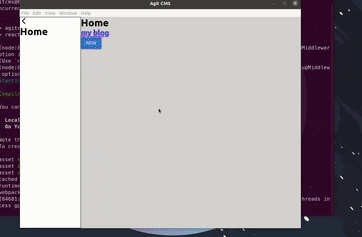

# Agit CMS

Open source desktop content manager for any static sites.

Still under development!!

TODO:

- [x] add new site(Site.jsx)
- [x] add new commands
- [x] add new frontmatter
- [x] pinned dir
- [x] command button
- [ ] use tui instead
- [ ] frontmatter editor
  - [ ] move frontmatter editor to side of main editor
- [ ] root settings (Settings.jsx)
- [ ] scroll sync
- [ ] styling
- [ ] image pasting
